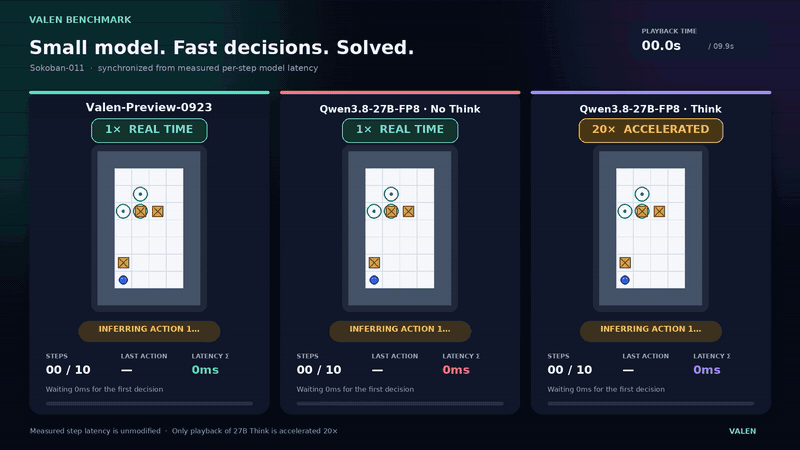
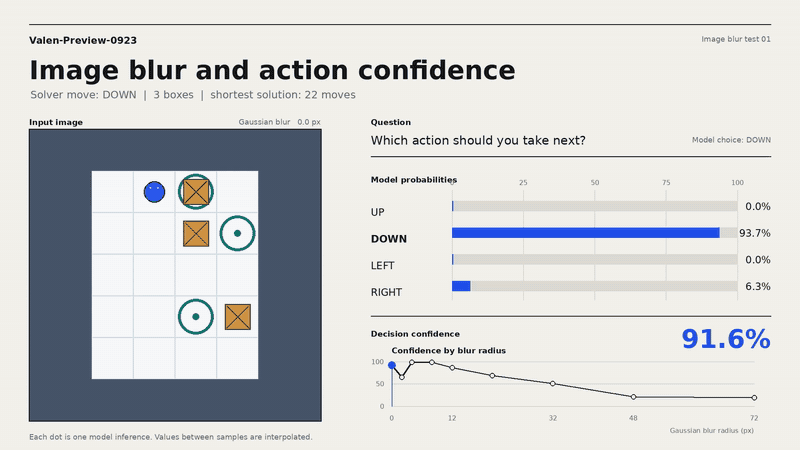
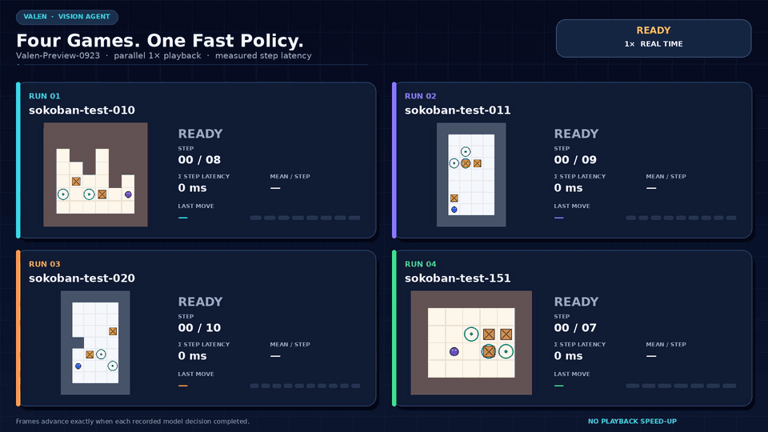
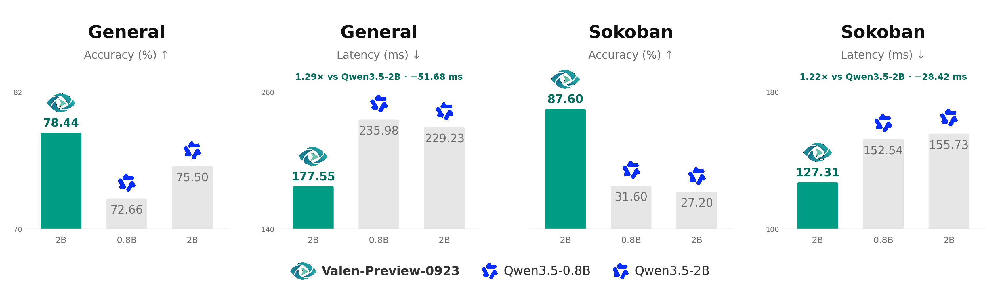

<p align="center">
  <br>
  
</p>

<p align="center">
  A multimodal decision model inspired by <a href="https://typesafe.ai/blog/introducing-system-one-models-and-jev">Jev</a> — text, images and video in; decision probabilities out.
</p>

<p align="center">
  <a href="https://huggingface.co/Valen-Team"></a>
  <a href="LICENSE"></a>
  <a href="pyproject.toml"></a>
  <a href="configs/train/"></a>
  <br>
  <a href="https://huggingface.co/Valen-Team/Valen-Preview-0923"></a>
  <a href="https://huggingface.co/datasets/Valen-Team/Valen-Training-General-100k"></a>
  <a href="https://huggingface.co/datasets/Valen-Team/Valen-Eval-General-5k"></a>
  <a href="https://huggingface.co/datasets/Valen-Team/Valen-Eval-Game"></a>
</p>

<p align="center">
  <b>English</b> · <a href="README_zh.md">简体中文</a><br>
  <a href="#introduction">Intro</a> · <a href="#demos">Demos</a> · <a href="#model-downloads">Model downloads</a> · <a href="#results">Eval results</a> · <a href="#quick-start">Quick start</a>
</p>

<a id="introduction"></a>

## ✨ Introduction

Valen (万澜) brings visual perception to System One decision-making. Inspired by [Jev](https://typesafe.ai/blog/introducing-system-one-models-and-jev), it evaluates text, images and video against task instructions and returns probabilities over supplied candidates, giving software a structured decision interface. A Qwen3.5-0.8B or 2B backbone and a shared decision head score candidates without generating answer tokens. The repository includes the model implementation, data processing, SFT and experimental RLCD training, and inference and evaluation commands, with support for training on your own data.

<a id="demos"></a>

## 🎬 Demos

<a id="demo-comparison"></a>

### Against a 27B generation model

**Valen-Preview-0923** reads the board image and selects a movement direction at each step. On the same level, Valen-Preview-0923 solves the puzzle in 9 decisions with 1.13 seconds of cumulative decision latency. Qwen3.8-27B-FP8 takes 198.05 seconds in thinking mode and fails to solve it in no-thinking mode.

<p align="center">
  <br>
</p>

### Image blur and action confidence

Gaussian blur reveals how **Valen-Preview-0923** adapts its decisions and confidence as visual detail decreases. Decision confidence is 91.6% on the clear image and 19.2% at the strongest blur.

<p align="center">
  <br>
</p>

### Four games in parallel

Four successful **Valen-Preview-0923** trajectories run side by side at 1× speed with no playback acceleration. Each game takes 7–10 decisions, averaging 122–128 ms per step, and all four finish within 1.24 seconds.

<p align="center">
  <br>
</p>

<a id="model-downloads"></a>

## 📥 Model downloads

Running Valen requires both the **Valen checkpoint** and the **Qwen3.5-2B base model**.

| Model | Role | Download |
| --- | --- | --- |
| Valen-Preview-0923 | Valen checkpoint | [🤗 Hugging Face](https://huggingface.co/Valen-Team/Valen-Preview-0923) |

Datasets: [General 100k training](https://huggingface.co/datasets/Valen-Team/Valen-Training-General-100k) · [General 5k evaluation](https://huggingface.co/datasets/Valen-Team/Valen-Eval-General-5k) · [Sokoban training and evaluation](https://huggingface.co/datasets/Valen-Team/Valen-Eval-Game).

<a id="results"></a>

## 📊 Evaluation results

**Lower latency, higher accuracy.** Four panels compare General accuracy, General latency, Sokoban accuracy and Sokoban latency, from left to right. Each panel shows Qwen3.5-0.8B, Qwen3.5-2B and a Valen 2B RL checkpoint. General uses 5,000 questions from multiple VQA datasets; Sokoban uses 500 single-step questions from 100 levels.

<p align="center">
  <a href="assets/figures/evaluation-results.png"></a>
</p>

See the [technical notes](docs/technical.md#完整实验) for training data, the Model Card and loss curves.

<a id="quick-start"></a>

## 🚀 Quick start

Install the dependencies listed in [requirements](docs/technical.md#环境要求), then download both the Preview checkpoint and its Qwen3.5-2B base model.

```bash
# Download the Valen-Preview-0923 checkpoint.
hf download Valen-Team/Valen-Preview-0923 --local-dir models/Valen-Preview-0923

# Download the Qwen3.5-2B base model.
hf download Qwen/Qwen3.5-2B --local-dir models/Qwen3.5-2B

# Train the model with your own configuration.
python -m valen.train \
  --config configs/train/sft_warmup.json

# Run inference with the downloaded Valen-Preview-0923 checkpoint.
python -m valen.inference \
  --checkpoint models/Valen-Preview-0923 \
  --data data/smoke/train.jsonl \
  --output output/sft_warmup/predictions.jsonl

# Check the evaluation pipeline on the same synthetic examples.
python -m valen.evaluate \
  --checkpoint models/Valen-Preview-0923 \
  --data data/smoke/train.jsonl \
  --output output/sft_warmup/smoke_eval
```

`data/smoke` contains a small set of simple questions for checking that the pipeline runs correctly.

<details>
<summary>A labeled record with an image input</summary>

Each JSONL line contains one record. The example below uses the [evaluation overview figure](assets/figures/evaluation-results.png) from the repository, assuming the file is saved as `example.jsonl` in the repository root.

```json
{
  "group_id": "evaluation-general-2b",
  "request": {
    "state": {
      "messages": [{
        "role": "user",
        "content": [
          {"type": "text", "text": "Compare the accuracy and the average latency per question of the 2B models on General in the figure."},
          {"type": "image_url", "image_url": {"url": "assets/figures/evaluation-results.png"}}
        ]
      }]
    },
    "questions": {
      "best_2b": {
        "type": "choice",
        "instructions": "On General, among the 2B models with average latency below 200 ms per question, which has the highest accuracy?",
        "criteria": {
          "qwen": "Qwen3.5-2B",
          "valen": "Valen-Preview-0923"
        }
      }
    }
  },
  "targets": {
    "best_2b": {"probabilities": {"qwen": 0.0, "valen": 1.0}}
  }
}
```
</details>

<a id="contributions"></a>

## 🤝 Contributions

Contributions to Valen are welcome. Open an [issue](https://github.com/Liuziyu77/Valen/issues) to report a problem, share a use case or discuss experimental results. Submit a [pull request](https://github.com/Liuziyu77/Valen/pulls) to improve the code or documentation, contribute training data or add evaluation tasks.

Scan the QR code below to join the Valen WeChat group, discuss the project and share your experiments.

<p align="center">
  
</p>

<a id="license-and-acknowledgments"></a>

## 📄 License and acknowledgments

The code is released under [Apache 2.0](LICENSE). Base models and source datasets retain their respective licenses.

Built on [Qwen3.5](https://huggingface.co/Qwen/Qwen3.5-2B), with the decision interface inspired by [TypeSafe's Jev](https://typesafe.ai/blog/introducing-system-one-models-and-jev).
