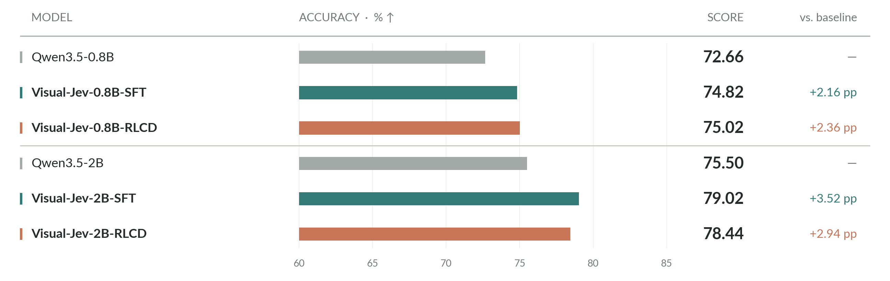
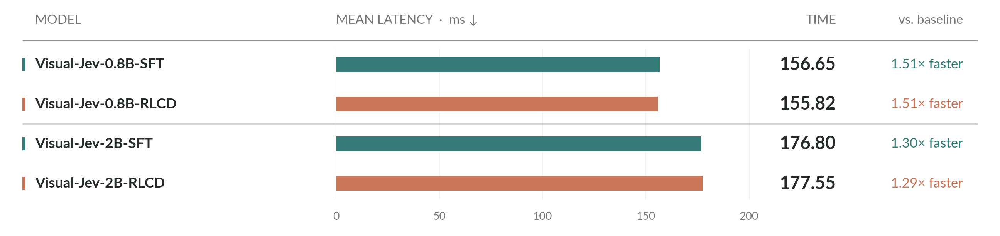
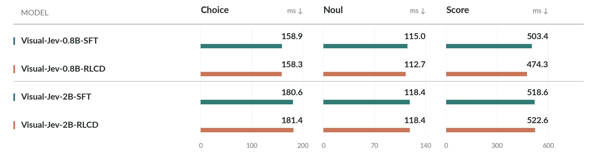
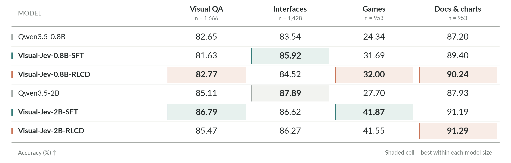

<p align="center">
  
</p>

<h1 align="center">Visual-Jev</h1>

<p align="center">Candidate scoring for text, images and video.</p>

<p align="center">
  <a href="LICENSE"></a>
  <a href="pyproject.toml"></a>
  <a href="configs/train/"></a>
</p>

<p align="center">
  <b>English</b> · <a href="README_zh.md">简体中文</a><br>
  <a href="#requirements">Requirements</a> · <a href="#quick-start">Quick start</a> · <a href="#training">Training</a> · <a href="#results">Results</a> · <a href="#documentation">Documentation</a>
</p>

Visual-Jev scores candidates based on text, images or video. It combines a Qwen3.5-0.8B or 2B backbone with a shared decision head to return probabilities without generating answer tokens. The repository includes the model, JSONL data processing, SFT and experimental RLCD training, and inference and evaluation commands.

## What it returns

| Output | Use it for | Response |
| --- | --- | --- |
| **Choice** | Select among 1–255 candidates | Selected candidate, full probability distribution, confidence |
| **Noul** | Check whether a condition holds | Probability of `true` |
| **Score** | Rate against 2–10 ordered descriptions | Expected level index, level probabilities, legend, confidence |

Candidates are supplied with each question. Tasks with different candidate counts share the same decision head. `confidence` measures how concentrated the distribution is.

<p align="center">
  
</p>

Choice and Noul score all candidates in one branch per question. Score runs a separate backbone forward pass for each level, then normalizes the logits together. The shared state is encoded once by the input compiler and processed by the backbone in each branch. See the [architecture](docs/architecture.md) and [response fields and formulas](docs/evaluation.md).

## Requirements

- Linux, Python 3.10+, and an NVIDIA GPU supporting BF16 with a CUDA 12.4-compatible driver.
- PyTorch 2.6.0, torchvision 0.21.0, Transformers 5.4.0, and PEFT 0.18.1.
- All dependencies are declared in [pyproject.toml](pyproject.toml) and installed by the setup script.

```bash
git clone https://github.com/Liuziyu77/Visual-Jev.git Visual-Jev
cd Visual-Jev
bash scripts/setup/bootstrap.sh
source .venv/bin/activate
```

For an existing Conda or virtualenv environment, see [manual installation](scripts/README.md#installation). The setup script creates `.venv`; it does not download model weights.

## Quick start

Install the [requirements](#requirements) and keep that environment activated. Model weights are downloaded separately from the Python packages.

```bash
# Download and verify the pinned Qwen3.5-0.8B snapshot.
python scripts/setup/prepare_model.py

# Train a decision head on the bundled synthetic examples.
python -m visionjev.train \
  --config configs/train/sft_warmup.json

# Run inference with the resulting checkpoint.
python -m visionjev.inference \
  --checkpoint output/sft_warmup/latest \
  --data data/smoke/train.jsonl \
  --output output/sft_warmup/predictions.jsonl

# Check the evaluation pipeline on the same synthetic examples.
python -m visionjev.evaluate \
  --checkpoint output/sft_warmup/latest \
  --data data/smoke/train.jsonl \
  --output output/sft_warmup/smoke_eval
```

The synthetic dataset contains six records and fifteen questions, thirteen with labels. Inference writes six response lines; evaluation writes thirteen predictions and `metrics.json`. These examples check the pipeline.

Run the commands from the repository root. Config paths are relative to the working directory; media paths in JSONL records are relative to the JSONL file.

<details>
<summary>A minimal labeled record</summary>

Each JSONL line contains one record. This expanded example defines a binary question with a hard label; soft probability labels are also supported.

```json
{
  "group_id": "traffic-light-001",
  "request": {
    "state": "The traffic light is green.",
    "questions": {
      "go": {
        "type": "noul",
        "instructions": "Only a green light permits crossing. Is crossing permitted?"
      }
    }
  },
  "targets": {
    "go": {"probabilities": {"true": 1.0, "false": 0.0}}
  },
  "assets": []
}
```

`targets` are training/evaluation labels and are excluded from model input. They can be omitted for inference, which still requires `group_id`. A Noul answer has the form `{"type": "noul", "noul": 0.8}`, where the number is `P(true)`. See the [synthetic examples](data/smoke/) and [data format](docs/data-format.md) for Choice, Score and media records.

</details>

## Training

`method` selects the training objective; `stage` selects which parameters to update. Four stages are available.

<p align="center">
  
</p>

SFT and RLCD both use labeled training data. Checkpoints from either method can be evaluated on held-out data and require the corresponding base model. Language-model fine-tuning currently uses LoRA; full fine-tuning is a future option.

| Stage | Trainable parameters | SFT | RLCD |
| --- | --- | --- | --- |
| `warmup` | Decision head | [Config](configs/train/sft_warmup.json) | [Config](configs/train/rlcd_warmup.json) |
| `text` | LLM LoRA + decision head; text-only data | [Config](configs/train/sft_text.json) | [Config](configs/train/rlcd_text.json) |
| `joint` | LLM LoRA + ViT merger + decision head | [Config](configs/train/sft_joint.json) | [Config](configs/train/rlcd_joint.json) |
| `vision_top` | `joint` + last four vision encoder layers | [Config](configs/train/sft_vision_top.json) | [Config](configs/train/rlcd_vision_top.json) |

For a full run, copy a config and set `model_path`, `data`, `output`, `epochs` and `max_steps`. `tokens_per_step` is a **per-GPU** budget summed over all question branches in each state. Training uses **data parallelism**, with a complete model on each GPU. Defaults and examples are in the [configuration reference](docs/configuration.md).

```bash
# Eight GPUs on one machine. Use a fresh output directory for each run.
VJ_GPUS=8 bash scripts/train/launch_sft.sh configs/train/sft_warmup.json

# RLCD starts from an existing decision-head checkpoint.
VJ_GPUS=8 bash scripts/train/launch_sft.sh configs/train/rlcd_warmup.json \
  --initialize output/sft_warmup/latest
```

SFT trains on supervised labels. RLCD uses a GRPO-style objective with rewards based on correctness and confidence error, a KL penalty against a fixed reference policy, and an optional Brier loss. Equations, initialization and resume commands are in the [training guide](visionjev/training/README.md).

Checkpoints store trainable parameter values and training state under `<output>/latest/`; the frozen base model is loaded separately. Each save overwrites `latest/`. `--initialize` starts a new experiment from existing weights; `--resume` restores the optimizer, data cursor and per-rank state and requires the same process count. `launch_sft.sh` supports both SFT and RLCD; use `VJ_PYTHON` to select an interpreter.

## Results

**100k training records · 5,000 held-out visual questions · 0.8B and 2B backbones.** Each model was trained on eight H200 GPUs, updating only the decision head. SFT uses all 100k records; RLCD denotes 70k SFT followed by 30k RLCD on the remaining records.

**Visual-Jev-2B-SFT reaches 79.02% accuracy**, gaining **3.52 percentage points** over its generation baseline. The **0.8B decision heads achieve about 1.51× end-to-end speedup** over their baseline.

### Accuracy

All six models use the same 5,000 test questions. `Qwen3.5-*` denotes the generation baselines; `Visual-Jev-{size}-SFT/RLCD` denotes the trained decision models. The accuracy bars use a **60–85%** scale.

<p align="center">
  <a href="assets/figures/eval3/accuracy.svg"></a>
</p>

### Inference time

The figure shows SFT and RLCD decision heads only. Mean end-to-end latency includes preprocessing, model computation and output handling. All measurements use the same eight-H200 host, with batch size 1 per GPU and three warmup requests per worker. Model loading and warmup are excluded; baseline timing used for the speedup comparison is available in [Eval_3](docs/experiments/eval3.md).

<p align="center">
  <a href="assets/figures/eval3/latency.svg"></a>
</p>

### Inference time by question type

SFT and RLCD latency for Choice, Noul and Score at both model sizes. Choice and Noul score candidates in one branch; Score runs a separate forward pass per level.

<p align="center">
  <a href="assets/figures/eval3/latency-by-task.svg"></a>
</p>

### Accuracy by application domain

Accuracy across visual question answering, user interfaces, games, and documents/charts. Highlighted cells mark the highest score in each domain within the same model size.

<p align="center">
  <a href="assets/figures/eval3/accuracy-by-domain.svg"></a>
</p>

See [Eval_3](docs/experiments/eval3.md) for the full protocol, per-source scores, P50/P95 latency, and probability metrics. These results use one seed and the supplied evaluation split. Click a chart for its SVG version. The [plotting script](scripts/eval/plot_eval3.py) reproduces the four evaluation figures from the bundled [result snapshot](assets/figures/eval3/results.json); full datasets and checkpoints are not bundled in Git.

## Repository layout

```text
visionjev/
  data/          Record validation, media loading and candidate compilation
  modeling/      Qwen3.5 backbone, decision head and trainable parameter groups
  training/      SFT/RLCD objectives, shared loop, gradient sync and checkpoints
  evaluation/    Inference responses, metrics and distributed evaluation
evaluation/      Task environments, Sokoban data generation and full-game evaluation
configs/train/   Eight example configs: two objectives × four stages
scripts/         Environment setup, model preparation, launchers and smoke checks
data/smoke/      Small synthetic text, image and video fixtures
tests/           CPU tests, including two-process training and resume checks
docs/            Architecture, data, configuration and evaluation references
```

The top-level `visionjev/train.py`, `inference.py` and `evaluate.py` forward to the corresponding subpackages. The [code map](visionjev/README.md) lists implementation entry points and their tests.

## Documentation

| Resource | Contents |
| --- | --- |
| [Architecture](docs/architecture.md) | Compilation, candidate scoring, branch cost and gradient synchronization |
| [Configuration reference](docs/configuration.md) | Defaults, token budgets, optimizer settings and RLCD options |
| [Training guide](visionjev/training/README.md) | SFT/RLCD objectives, distributed training and checkpoint recovery |
| [Script guide](scripts/README.md) | Setup, training, evaluation and smoke checks |
| [Code map](visionjev/README.md) | Data, modeling, training and evaluation modules |
| [Data format](docs/data-format.md) | Complete examples, labels, local media and split conventions |
| [Inference and evaluation](docs/evaluation.md) | Response fields, confidence formulas, metrics and timing |
| [Experiment report](docs/experiments/eval3.md) | 100k training comparison, full scores and latency protocol |
| [Task evaluation](evaluation/README.md) | Sokoban generation, full-game evaluation, policy comparison and replay |

The detailed guides are currently in Chinese; both READMEs cover setup and training. To run the CPU suite (processor tests skip until the base-model processor is available):

```bash
python -m pytest -q
```

## License and acknowledgments

The code is released under [Apache 2.0](LICENSE). Base models and source datasets retain their respective licenses.

Built on [Qwen3.5](https://huggingface.co/Qwen/Qwen3.5-2B), with the decision interface inspired by [TypeSafe's Jev](https://typesafe.ai/blog/introducing-system-one-models-and-jev).
