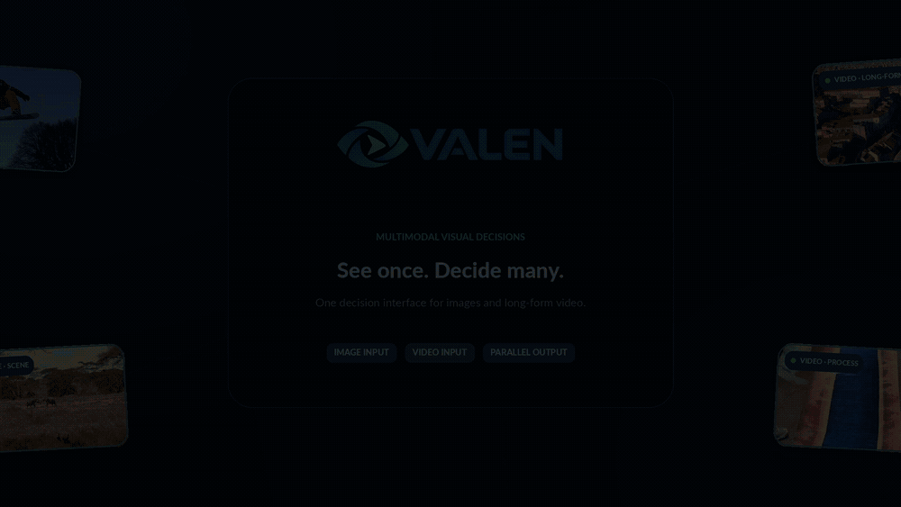
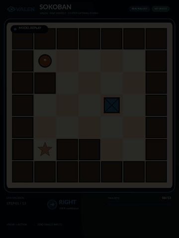
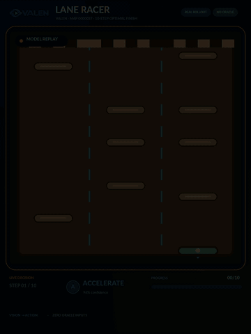
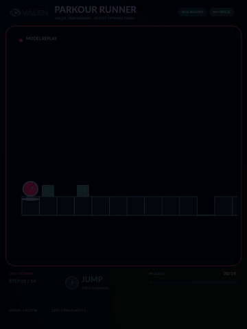
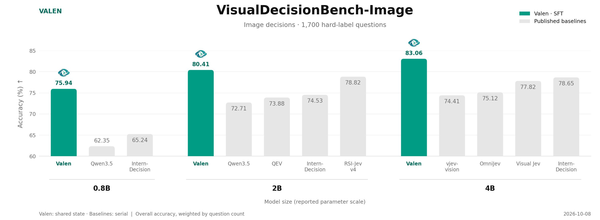
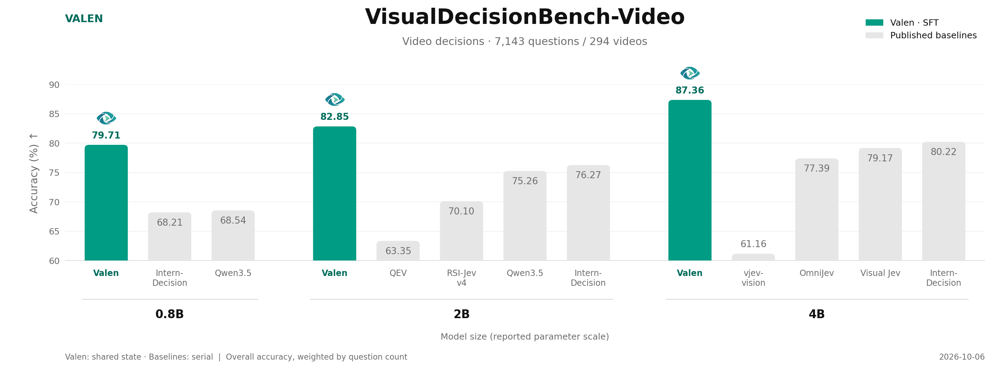
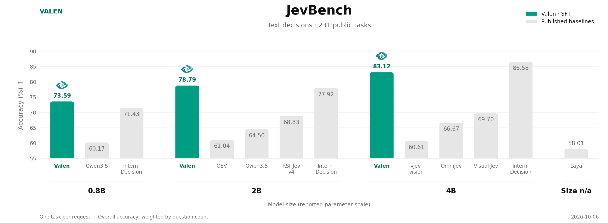

<p align="center">
  <br>
  
</p>

<p align="center">
  A multimodal decision model inspired by <a href="https://typesafe.ai/blog/introducing-system-one-models-and-jev">Jev</a> — text, images and video in; decision probabilities out.
</p>

<p align="center">
  <a href="https://huggingface.co/Valen-Team"></a>
  <a href="LICENSE"></a>
  <a href="pyproject.toml"></a>
  <a href="configs/train/"></a>
  <br>
  <a href="https://huggingface.co/Valen-Team/Valen-0.8B"></a>
  <a href="https://huggingface.co/Valen-Team/Valen-2B"></a>
  <a href="https://huggingface.co/Valen-Team/Valen-4B"></a>
  <a href="https://huggingface.co/spaces/yuhangzang/Valen-Preview-0923"></a>
  <a href="https://huggingface.co/datasets/Valen-Team/Valen-Training-General-100k"></a>
  <a href="https://huggingface.co/datasets/Valen-Team/VisualDecisionBench"></a>
  <a href="https://huggingface.co/datasets/Valen-Team/Valen-Eval-Game"></a>
</p>

<p align="center">
  <b>English</b> · <a href="README_zh.md">简体中文</a><br>
  <a href="#introduction">Intro</a> · <a href="#news">News</a> · <a href="#demos">Demos</a> · <a href="#model-downloads">Models &amp; datasets</a> · <a href="#results">Eval results</a> · <a href="#quick-start">Quick start</a>
</p>

<a id="introduction"></a>

## ✨ Introduction

Valen (万澜) brings visual perception to System One decision-making. Inspired by [Jev](https://typesafe.ai/blog/introducing-system-one-models-and-jev), it evaluates text, images and video against task instructions and returns probabilities over supplied candidates, giving software a structured decision interface. The repository includes the model implementation, data processing, SFT and experimental RLCD training, and inference and evaluation commands, with support for training on your own data.

<a id="news"></a>

## 📰 News

- **2026-10-07**: **Faster, more accurate, more versatile.** Released the latest multimodal System One model **Valen ([0.8B](https://huggingface.co/Valen-Team/Valen-0.8B), [2B](https://huggingface.co/Valen-Team/Valen-2B) and [4B](https://huggingface.co/Valen-Team/Valen-4B))**, supporting text, images and video, and the [**VisualDecisionBench**](https://huggingface.co/datasets/Valen-Team/VisualDecisionBench) benchmark.
- **2026-09-30**: **Training&Inference Support:** Added Flash Attention 2 support, enabled training across multiple nodes and GPUs, and improved GPU memory utilization during training.
- **2026-09-23**: Open-sourced the **Valen** repository and released [**Valen-preview-0923**](https://huggingface.co/Valen-Team/Valen-Preview-0923) with its corresponding [**training data**](https://huggingface.co/datasets/Valen-Team/Valen-Training-General-100k).

<a id="demos"></a>

## 🎬 Demos

**Valen** image and video decision-making — click the preview to watch the full demo.

<p align="center">
  <a href="assets/demos/Valen.mp4"></a>
</p>

**Game decision-making** — five successful Valen rollouts. Click any preview to watch the full video.

<table>
  <tr>
    <td colspan="2" width="33%" align="center">
      <a href="assets/demos/games/valen-sokoban.mp4"></a><br>
      <b>Sokoban</b><br><sub>Plans a 13-step optimal solution.</sub>
    </td>
    <td colspan="2" width="33%" align="center">
      <a href="assets/demos/games/valen-frozen-lake.mp4"></a><br>
      <b>Frozen Lake</b><br><sub>Finds an 11-step optimal route around hazards.</sub>
    </td>
    <td colspan="2" width="33%" align="center">
      <a href="assets/demos/games/valen-maze.mp4"></a><br>
      <b>Maze</b><br><sub>Completes a 22-step long-horizon route.</sub>
    </td>
  </tr>
  <tr>
    <td colspan="3" width="50%" align="center">
      <a href="assets/demos/games/valen-lane-racer.mp4"></a><br>
      <b>Lane Racer</b><br><sub>Changes lanes and clears the course in 10 steps.</sub>
    </td>
    <td colspan="3" width="50%" align="center">
      <a href="assets/demos/games/valen-parkour.mp4"></a><br>
      <b>Parkour Runner</b><br><sub>Chains jumps, dashes, ducks and runs over 14 steps.</sub>
    </td>
  </tr>
</table>

<a id="model-downloads"></a>

## 📥 Models and datasets

| Model | Download |
| --- | --- |
| Valen 0.8B | [🤗 Valen-0.8B](https://huggingface.co/Valen-Team/Valen-0.8B) |
| Valen 2B | [🤗 Valen-2B](https://huggingface.co/Valen-Team/Valen-2B) |
| Valen 4B | [🤗 Valen-4B](https://huggingface.co/Valen-Team/Valen-4B) |
| Valen-preview-0923 (earlier release) | [🤗 Hugging Face](https://huggingface.co/Valen-Team/Valen-Preview-0923) |

[VisualDecisionBench](https://huggingface.co/datasets/Valen-Team/VisualDecisionBench) contains Image and Video subsets for visual decision evaluation. Earlier releases include [General 100k](https://huggingface.co/datasets/Valen-Team/Valen-Training-General-100k) for training, [General 5k](https://huggingface.co/datasets/Valen-Team/Valen-Eval-General-5k) for evaluation, and [Sokoban](https://huggingface.co/datasets/Valen-Team/Valen-Eval-Game) for game training and evaluation.

<a id="results"></a>

## 📊 Evaluation results — Valen

**Visual decisions at 0.8B, 2B and 4B.** Valen uses Qwen3.5 + Mixer with shared-state inference, trained with SFT on millions of samples. The evaluation compares these checkpoints with published decision models on **VisualDecisionBench-Image, VisualDecisionBench-Video and public JevBench**.

<p align="center">
  <a href="assets/figures/evaluation-20261006/eval_v1.png"></a>
</p>

<p align="center">
  <a href="assets/figures/evaluation-20261006/video.png"></a>
</p>

<p align="center">
  <a href="assets/figures/evaluation-20261006/jevbench.png"></a>
</p>

Earlier results remain in the [archived README](history/README_preview.md).

<a id="quick-start"></a>

## 🚀 Quick start

[Install the dependencies](scripts/README.md#installation). Run `hf auth login` if the Hugging Face repositories require access.

### 1. Inference

```python
import torch
from transformers import AutoModel

model = AutoModel.from_pretrained(
    "Valen-Team/Valen-2B", trust_remote_code=True, dtype="auto",
    attn_implementation="sdpa",
).to("cuda").eval()
torch.set_float32_matmul_precision("highest")
torch.backends.cudnn.allow_tf32 = False

print(model.predict({
    "state": "A cat is on the sofa.",
    "questions": {
        "animal": {"type": "choice", "instructions": "Which animal is present?",
                   "criteria": {"cat": "A cat", "dog": "A dog"}},
        "on_sofa": {"type": "noul", "instructions": "The cat is on the sofa."},
    },
}, execution="shared_state"))
```

Use `execution="question"` for separate questions or `attn_implementation="flash_attention_2"` with Flash Attention installed. Image/video inputs follow the [data format](docs/data-format.md).

### 2. Evaluate VisualDecisionBench

Download and unpack the media, then run the [evaluation script](evaluation/visualdecisionbench/evaluate.py):

```bash
hf download Valen-Team/VisualDecisionBench --repo-type dataset --local-dir data/VisualDecisionBench
python data/VisualDecisionBench/unpack_assets.py
python -m evaluation.visualdecisionbench.evaluate \
  --model Valen-Team/Valen-2B --data data/VisualDecisionBench \
  --output output/visualdecisionbench
```

Add `--lora --revision lora-ckpt` to evaluate the earlier LoRA model. Outputs: `predictions.jsonl` and `metrics.json`, including image/video and Choice/Noul/Score breakdowns and elapsed time. Videos use 16 frames; accuracy uses hard labels, while soft-label Score questions contribute probability metrics.

### 3. Training

The shared-state recipes use Mixer. Install Flash Attention 2 or set `model.attn_implementation` to `sdpa`. Set your data paths, output directories and training budget in the [configs](configs/train/qwen/); the defaults use smoke data and a 100-step limit.

```bash
python scripts/setup/prepare_model.py

# Two-stage SFT: head warmup, then joint LoRA + Mixer + visual merger.
python -m valen.train --config configs/train/qwen/sft_shared_state_warmup.json
python -m valen.train --config configs/train/qwen/sft_shared_state_joint.json \
  --initialize output/qwen-shared-state/warmup/latest

# RLCD: candidate-action RL initialized from the SFT checkpoint.
python -m valen.train --config configs/train/qwen/rlcd_shared_state_joint.json \
  --initialize output/qwen-shared-state/joint/latest
```

For **full training**, keep the warmup stage and replace the joint SFT recipe with [`sft_shared_state_full_joint.json`](configs/train/qwen/sft_shared_state_full_joint.json), using the same `--initialize` checkpoint. This sets `model.finetuning_type="full"` and updates the language backbone, vision backbone and Mixer; `"lora"` selects adapter training. Set the model and data paths in both stages consistently.

```bash
python -m valen.train --config configs/train/qwen/sft_shared_state_full_joint.json \
  --initialize output/qwen-shared-state/warmup/latest
```

For multiple GPUs, use `VALEN_GPUS=8 bash scripts/train/launch.sh <config> [--initialize <checkpoint>]`. See the [training guide](valen/training/README.md) for RLCD rewards and checkpoint recovery.

<a id="contributions"></a>

## 🤝 Contributions

Contributions to Valen are welcome. Open an [issue](https://github.com/Liuziyu77/Valen/issues) to report a problem, share a use case or discuss experimental results. Submit a [pull request](https://github.com/Liuziyu77/Valen/pulls) to improve the code or documentation, contribute training data or add evaluation tasks. Active contributors can become part of Valen's core development team.

Scan the QR code below to join the Valen WeChat group, discuss the project and share your experiments.

<p align="center">
  
</p>

<a id="license-and-acknowledgments"></a>

## 📄 License and acknowledgments

The code is released under [Apache 2.0](LICENSE). Base models and source datasets retain their respective licenses.

Built on [Qwen3.5](https://huggingface.co/Qwen/Qwen3.5-2B), with the decision interface inspired by [TypeSafe's Jev](https://typesafe.ai/blog/introducing-system-one-models-and-jev).
