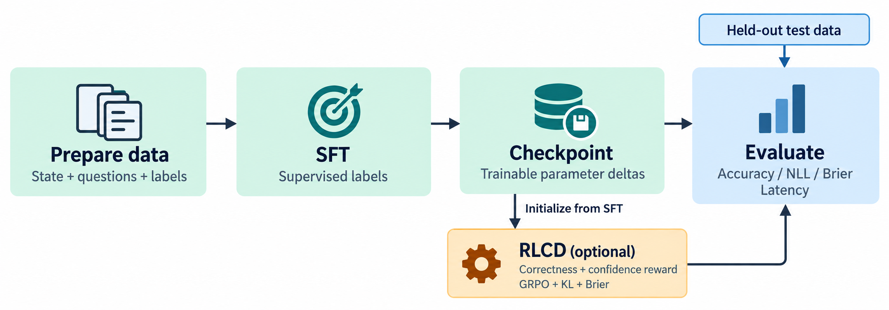
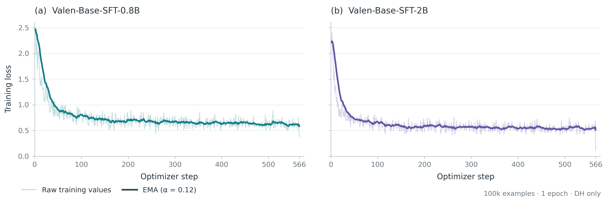
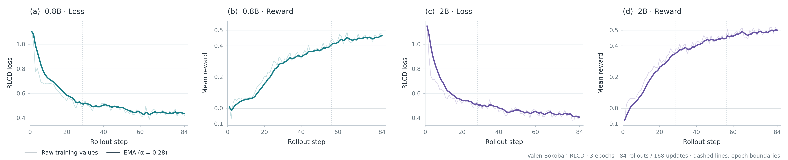
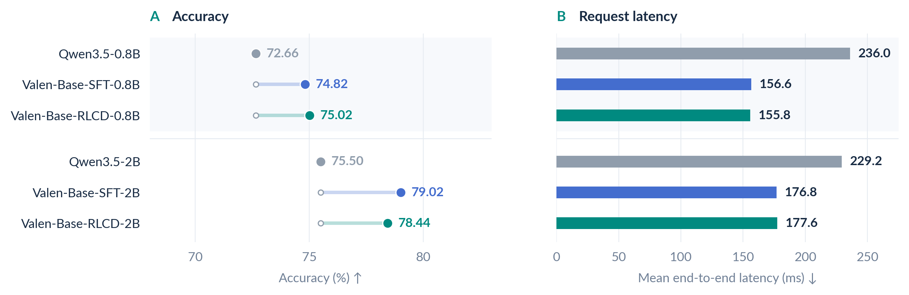
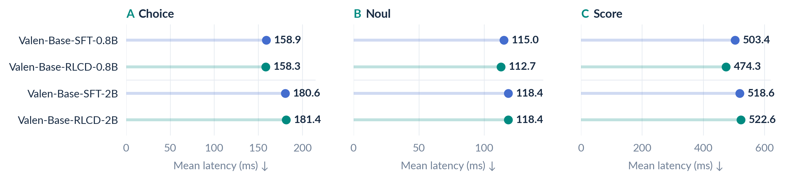
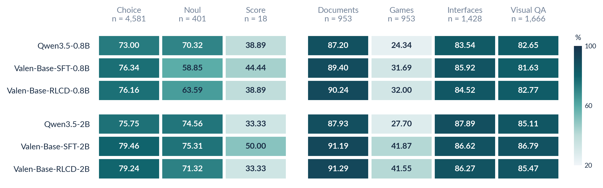
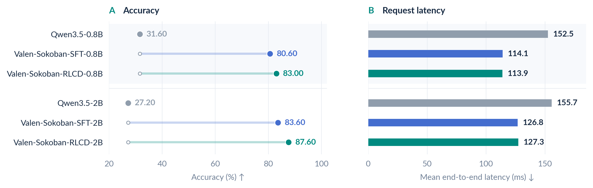
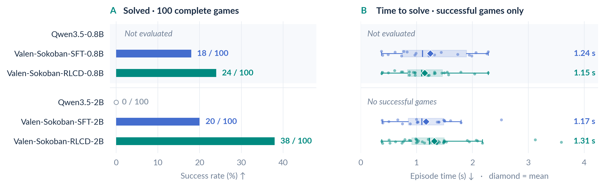

<p align="center">
  
</p>

<h1 align="center"></h1>

<h2 align="center">System One Model, now with vision.</h2>

<p align="center">
  A multimodal decision model inspired by <a href="https://typesafe.ai/blog/introducing-system-one-models-and-jev">Jev</a> — text, images and video in; decision probabilities out.
</p>

<p align="center">
  <a href="https://huggingface.co/Valen-Team"></a>
  <a href="LICENSE"></a>
  <a href="pyproject.toml"></a>
  <a href="configs/train/"></a>
  <br>
  <a href="https://huggingface.co/Valen-Team/Valen-Preview-0923"></a>
  <a href="https://huggingface.co/datasets/Valen-Team/Valen-Training-General-100k"></a>
  <a href="https://huggingface.co/datasets/Valen-Team/Valen-Eval-General-5k"></a>
  <a href="https://huggingface.co/datasets/Valen-Team/Valen-Eval-Game"></a>
</p>

<p align="center">
  <a href="README.md">English</a> · <b>简体中文</b><br>
  <a href="#环境要求">🛠️ 环境要求</a> · <a href="#快速开始">🚀 快速开始</a> · <a href="#训练">🧠 训练</a> · <a href="#实验结果">📊 实验结果</a> · <a href="#demo-comparison">🎬 演示</a> · <a href="#文档">📚 文档</a>
</p>

Valen 的名字来自生物学家 Leigh Van Valen 提出的“红皇后假说”：环境不断变化，想留在原地也得不停进化————AI时代，智能也要持续适应新的任务和环境。

Valen（万澜）将视觉感知引入 System One 决策。受 [Jev](https://typesafe.ai/blog/introducing-system-one-models-and-jev) 启发，它根据任务指令，对文本、图像和视频中的信息进行判断，直接输出给定候选的概率分布，为程序提供结构化的决策接口。模型以 Qwen3.5-0.8B/2B 为骨干，通过共享决策头完成评分，无需生成答案 token。仓库提供模型实现、数据处理、SFT 与实验性 RLCD 训练，以及推理和评估命令，支持使用自有数据训练。

<a id="demo-comparison"></a>

<p align="center">
  <a href="assets/demos/sokoban-model-comparison.mp4"></a><br>
  <sub><strong> Valen-Preview-0923 以 1.13 秒累计决策耗时通关；Qwen3.8-27B-FP8 的 thinking 模式耗时 198.05 秒，no-thinking 模式未通关。</strong></sub><br>
</p>

<a id="输出类型"></a>

## 🎯 输出类型

| 类型 | 用途 | 返回内容 |
| --- | --- | --- |
| **Choice** | 从 1–255 个候选中选择 | 所选候选、完整概率分布、confidence |
| **Noul** | 判断条件是否成立 | `true` 的概率 |
| **Score** | 按 2–10 个有序描述评分 | 等级编号期望值、等级概率、legend、confidence |

候选随问题传入，不同任务和候选数量共用决策头。`confidence` 描述分布集中度。

<p align="center">
  
</p>

Choice 和 Noul 每道题用一个分支计算全部候选；Score 每个等级单独执行backbone forward pass，再将 logits 一起归一化。公共 state 只编码一次，但在backbone的每个分支中重复计算。详见[架构说明](docs/architecture.md)和[响应字段与公式](docs/evaluation.md)。

<a id="环境要求"></a>

## 🛠️ 环境要求

- Linux、Python 3.10+，NVIDIA GPU。
- PyTorch 2.6.0、torchvision 0.21.0、Transformers 5.4.0、PEFT 0.18.1。
- 完整依赖见 [pyproject.toml](pyproject.toml)，安装脚本会自动安装。

```bash
git clone https://github.com/Liuziyu77/Valen.git Valen
cd Valen
bash scripts/setup/bootstrap.sh
source .venv/bin/activate
```

已有 Conda 或 virtualenv 环境时，参见[手动安装说明](scripts/README.md#installation)。安装脚本创建 `.venv`，模型权重需要另行下载。

<a id="快速开始"></a>

## 🚀 快速开始

先按[环境要求](#环境要求)安装依赖。依赖安装完成后，需下载模型权重。

```bash
# 下载 Qwen3.5-2B Base 模型。
hf download Qwen/Qwen3.5-2B --local-dir models/Qwen3.5-2B

# 用随仓库提供的合成样本训练决策头。
python -m valen.train \
  --config configs/train/sft_warmup.json

# 加载训练得到的 checkpoint 进行推理。
python -m valen.inference \
  --checkpoint output/sft_warmup/latest \
  --data data/smoke/train.jsonl \
  --output output/sft_warmup/predictions.jsonl

# 用同一组合成样本检查评估流程。
python -m valen.evaluate \
  --checkpoint output/sft_warmup/latest \
  --data data/smoke/train.jsonl \
  --output output/sft_warmup/smoke_eval
```

`data/smoke` 有少量简单题目，仅仅用于测试功能是否正常运行。

<details>
<summary>一条带图片输入的标注记录</summary>

JSONL 每行是一条记录。下例使用仓库里的[通用实验总览图](assets/figures/general/overview.png)，假设保存为仓库根目录的 `example.jsonl`。

```json
{
  "group_id": "general-overview-2b",
  "request": {
    "state": {
      "messages": [{
        "role": "user",
        "content": [
          {"type": "text", "text": "比较图中 2B 模型的准确率和平均单题耗时。"},
          {"type": "image_url", "image_url": {"url": "assets/figures/general/overview.png"}}
        ]
      }]
    },
    "questions": {
      "best_2b": {
        "type": "choice",
        "instructions": "在平均单题耗时低于 200 ms 的 2B 模型中，哪个准确率最高？",
        "criteria": {
          "qwen": "Qwen3.5-2B",
          "sft": "Valen-Base-SFT-2B",
          "rlcd": "Valen-Base-RLCD-2B"
        }
      }
    }
  },
  "targets": {
    "best_2b": {"probabilities": {"qwen": 0.0, "sft": 1.0, "rlcd": 0.0}}
  }
}
```
</details>

<a id="训练"></a>

## 🧠 训练

当前 Valen 支持 `SFT` 和 `RLCD` 两种训练 `method`，`stage` 决定更新哪些参数，当前支持四种 stage 配置。

<p align="center">
  
</p>

SFT 和 RLCD 均使用带标签的训练数据。两种方法的 checkpoint 都可在独立测试集上评估，加载时还需对应的base model（目前实现的是LoRA，后续可考虑全量微调）。

| Stage | 更新参数 | SFT | RLCD |
| --- | --- | --- | --- |
| `warmup` | 决策头 | [配置](configs/train/sft_warmup.json) | [配置](configs/train/rlcd_warmup.json) |
| `text` | LLM LoRA、决策头；使用纯文本数据 | [配置](configs/train/sft_text.json) | [配置](configs/train/rlcd_text.json) |
| `joint` | LLM LoRA、VIT merger、决策头 | [配置](configs/train/sft_joint.json) | [配置](configs/train/rlcd_joint.json) |
| `vision_top` | `joint` 加视觉编码器最后 4 层 | [配置](configs/train/sft_vision_top.json) | [配置](configs/train/rlcd_vision_top.json) |

正式训练前复制一份配置，设置 `model_path`、`data`、`output`、`epochs` 和 `max_steps`。`tokens_per_step` 是**每张 GPU** 的预算，按 state 内全部问题分支的 token 总量计算。每卡持有完整模型，采用**数据并行**。默认值与修改示例见[配置参考](docs/configuration.md)。

```bash
# 单机八卡；每次独立实验使用新的输出目录。
VJ_GPUS=8 bash scripts/train/launch_sft.sh configs/train/sft_warmup.json

# RLCD 从已的 SFT 的决策头的 checkpoint 上初始化。
VJ_GPUS=8 bash scripts/train/launch_sft.sh configs/train/rlcd_warmup.json \
  --initialize output/sft_warmup/latest
```

目前 SFT 使用标签监督；RLCD 使用 GRPO 形式，奖励同时考虑正确性和置信度误差，另加固定参考策略的 KL 约束和可选的 Brier 损失。公式、初始化和断点恢复命令见[训练说明](valen/training/README.md)。

checkpoint 将可训练参数的值和训练状态保存在 `<output>/latest/`，冻结的base模型另行加载。每次保存会覆盖 `latest/`，不保留历史版本。`--initialize` 从已有权重开始新实验；`--resume` 恢复优化器、数据游标和各 rank 状态，要求进程数不变。`launch_sft.sh` 共用于 SFT 和 RLCD，可通过 `VJ_PYTHON` 指定解释器。

<a id="实验结果"></a>

## 📊 实验结果

### Model Card

我们对模型的训练方法，训练数据进行了消融实验：

| 模型 | 训练方法 | 数据 | 数据集 |
| --- | --- | --- | --- |
| Valen-Base-SFT-0.8B | SFT | General SFT 100k | [](https://huggingface.co/datasets/Valen-Team/Valen-Training-General-100k) |
| Valen-Base-SFT-2B | SFT | General SFT 100k | [](https://huggingface.co/datasets/Valen-Team/Valen-Training-General-100k) |
| Valen-Base-RLCD-0.8B | SFT + RLCD | General SFT 70k + General RLCD 30k | [](https://huggingface.co/datasets/Valen-Team/Valen-Training-General-100k) |
| Valen-Base-RLCD-2B | SFT + RLCD | General SFT 70k + General RLCD 30k | [](https://huggingface.co/datasets/Valen-Team/Valen-Training-General-100k) |
| Valen-Sokoban-SFT-2B | SFT + SFT | General SFT 100k + Sokoban SFT 30k | [](https://huggingface.co/datasets/Valen-Team/Valen-Training-General-100k) [](https://huggingface.co/datasets/Valen-Team/Valen-Eval-Game) |
| Valen-Sokoban-RLCD-2B | SFT + RLCD | General SFT 100k + Sokoban RLCD 30k | [](https://huggingface.co/datasets/Valen-Team/Valen-Training-General-100k) [](https://huggingface.co/datasets/Valen-Team/Valen-Eval-Game) |

Sokoban 的训练集和评测集均包含在 [Valen-Eval-Game](https://huggingface.co/datasets/Valen-Team/Valen-Eval-Game) 中，训练与评测分别使用对应划分。

#### Training Loss

<p align="center">
  <a href="assets/figures/training/sft100k_loss.png"></a><br>
  <sub>General SFT：0.8B 与 2B 的训练 loss。</sub>
</p>

<p align="center">
  <a href="assets/figures/training/sokoban_rlcd_loss_reward.png"></a><br>
  <sub>Sokoban RLCD：0.8B 与 2B 的训练 loss 和 reward。</sub>
</p>

### General：通用VQA

[100k 训练集](https://huggingface.co/datasets/Valen-Team/Valen-Training-General-100k)、[5k 测试集](https://huggingface.co/datasets/Valen-Team/Valen-Eval-General-5k)，底座为 Qwen3.5-0.8B 和 2B。每次训练使用八张 H200，仅更新决策头：SFT 使用全部 100k 数据；两阶段方案先用 70k 做 SFT，再用剩余 30k 做 RLCD。图中的 `Valen-Base-*` 是训练后的决策模型，`Qwen3.5-*` 是原始生成基线。

<p align="center">
  <a href="assets/figures/general/overview.png"></a>
</p>

**Valen-Base-SFT-2B 的准确率为 79.02%**，比同规格基线高 **3.52 个百分点**。0.8B 的 SFT 和 RLCD 模型单题平均耗时分别为 156.65 和 155.82 毫秒，相对 235.98 毫秒的基线约快 1.51 倍。端到端耗时包含预处理、模型计算和输出处理。

<p align="center">
  <a href="assets/figures/general/task-latency.png"></a>
</p>

Choice 和 Noul 在同一分支中计算候选；Score 为每个等级单独运行forward。下图列出各题型及应用领域的准确率。Score 只有 18 题。

<p align="center">
  <a href="assets/figures/general/breakdown.png"></a>
</p>

完整设置、各数据来源分数、P50/P95 耗时及概率指标见[通用实验报告](docs/experiments/general.md)。

### Sokoban：推箱子游戏

四个 `Valen-Sokoban-*` 模型从通用实验的 100k SFT decision head出发，在 [Sokoban](https://huggingface.co/datasets/Valen-Team/Valen-Eval-Game) 数据上以 `vision_top` 模式续训 3 个 epoch。六个模型使用同一批来自 100 关的 500 道单步题；**预测属于任一最优动作即算正确**。

<p align="center">
  <a href="assets/figures/sokoban/overview.png"></a>
</p>

| 模型 | 单步正确 / 500 | 单步端到端均值 | 完整游戏通关 / 100 |
| --- | ---: | ---: | ---: |
| Qwen3.5-0.8B | 158（31.60%） | 152.54 ms | 未评测 |
| Valen-Sokoban-SFT-0.8B | 403（80.60%） | 114.06 ms | 18 |
| Valen-Sokoban-RLCD-0.8B | 415（83.00%） | 113.95 ms | 24 |
| Qwen3.5-2B | 136（27.20%） | 155.73 ms | 0 |
| Valen-Sokoban-SFT-2B | 418（83.60%） | 126.82 ms | 20 |
| Valen-Sokoban-RLCD-2B | 438（87.60%） | 127.31 ms | 38 |

单步准确率不等于完整游戏通关率。单步耗时在单张 H200 上以 batch size 1 测得，预热三题，不计模型加载。完整游戏每关从初态开始，只尝试一次，最多 200 步，不使用动作缓存、回退或求解器；下图右侧的耗时仅统计成功通关的局。评测流程见 [Sokoban 说明](evaluation/sokoban/README.md)。

<p align="center">
  <a href="assets/figures/sokoban/full-games.png"></a>
</p>

<a id="演示"></a>

## 🎬 演示

### 四局并行能力展示

四条成功的 **Valen-Preview-0923** 轨迹以 1× 速度并排播放，不做加速。每局需要 7–10 次决策，平均每步 122–128 毫秒，四局均于 1.24 秒内完成。

<p align="center">
  <a href="assets/demos/sokoban-four-game-showcase.mp4"></a><br>
</p>


<a id="仓库结构"></a>

## 📁 仓库结构

```text
valen/
  data/          记录校验、媒体读取、候选编译
  modeling/      Qwen3.5 backbone、decision head、可训练参数组
  training/      SFT/RLCD 目标、共用循环、梯度同步、checkpoint
  evaluation/    推理响应、指标、多卡评估
evaluation/      任务环境、Sokoban 数据生成与完整游戏评测
configs/train/   两种训练目标 × 四种 stage，共八份示例
scripts/         环境安装、模型准备、训练启动器、GPU 检查
data/smoke/      文本、图片、视频合成样例
tests/           CPU 测试，包含双进程训练与恢复检查
docs/            架构、数据、配置、评估说明
```

<a id="文档"></a>

## 📚 文档

| 文档 | 内容 |
| --- | --- |
| [架构说明](docs/architecture.md) | 编译流程、候选评分、分支开销、梯度同步 |
| [配置参考](docs/configuration.md) | 默认值、token 预算、优化器和 RLCD 参数 |
| [训练说明](valen/training/README.md) | SFT/RLCD 目标、多卡训练、断点恢复 |
| [脚本说明](scripts/README.md) | 环境、训练、评估和数据工具 |
| [代码目录](valen/README.md) | 数据、模型、训练和评估模块 |
| [数据格式](docs/data-format.md) | 完整样例、标签、本地媒体和数据划分 |
| [推理与评估](docs/evaluation.md) | 响应字段、confidence 公式、指标和计时口径 |
| [实验结果](docs/experiments/general.md) | 100k 训练对照、完整分数和统一测速条件 |
| [任务评测](evaluation/README.md) | Sokoban 数据生成、完整游戏评测、策略比较和轨迹回放 |


<a id="许可与致谢"></a>

## 🤝 许可与致谢

代码使用 [Apache 2.0](LICENSE) 许可。基础模型和来源数据集遵循各自的许可。

模型基于 [Qwen3.5](https://huggingface.co/Qwen/Qwen3.5-2B)，决策接口受 [TypeSafe Jev](https://typesafe.ai/blog/introducing-system-one-models-and-jev) 启发。

欢迎一起改进 Valen。你可以通过 [Issues](https://github.com/Liuziyu77/Valen/issues) 反馈问题、分享应用场景和实验结果，也可以提交 [Pull Requests](https://github.com/Liuziyu77/Valen/pulls) 改进代码与文档、补充训练数据或评测任务。
