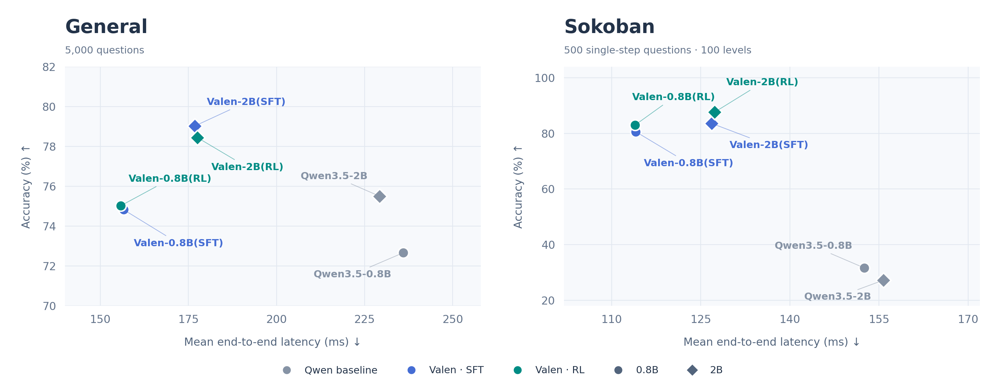

<p align="center">
  
</p>

<h2 align="center"></h2>

<p align="center">
  A multimodal decision model inspired by <a href="https://typesafe.ai/blog/introducing-system-one-models-and-jev">Jev</a> — text, images and video in; decision probabilities out.
</p>

<p align="center">
  <a href="https://huggingface.co/Valen-Team"></a>
  <a href="LICENSE"></a>
  <a href="pyproject.toml"></a>
  <a href="configs/train/"></a>
  <br>
  <a href="https://huggingface.co/Valen-Team/Valen-Preview-0923"></a>
  <a href="https://huggingface.co/datasets/Valen-Team/Valen-Training-General-100k"></a>
  <a href="https://huggingface.co/datasets/Valen-Team/Valen-Eval-General-5k"></a>
  <a href="https://huggingface.co/datasets/Valen-Team/Valen-Eval-Game"></a>
</p>

<p align="center">
  <a href="README.md">English</a> · <b>简体中文</b><br>
  <a href="#简介">简介</a> · <a href="#演示">演示</a> · <a href="#模型下载">模型下载</a> · <a href="#实验结果">评测结果</a> · <a href="#快速开始">快速开始</a>
</p>

<a id="简介"></a>

## ✨ 简介

Valen（万澜）将视觉感知引入 System One 决策。受 [Jev](https://typesafe.ai/blog/introducing-system-one-models-and-jev) 启发，它根据任务指令，对文本、图像和视频中的信息进行判断，直接输出给定候选的概率分布，为程序提供结构化的决策接口。模型以 Qwen3.5-0.8B/2B 为骨干，通过共享决策头完成评分，无需生成答案 token。仓库提供模型实现、数据处理、SFT 与实验性 RLCD 训练，以及推理和评估命令，支持使用自有数据训练。

<a id="演示"></a>

## 🎬 演示

<a id="demo-comparison"></a>

<p align="center">
  <video src="assets/demos/sokoban-model-comparison.mp4" controls muted playsinline width="1000" aria-label="Valen-Preview-0923 与 Qwen3.8-27B-FP8 的 no-thinking 和 thinking 模式并排对比。">
    <a href="assets/demos/sokoban-model-comparison.mp4">观看视频（MP4）</a>
  </video><br>
  <sub><strong> Valen-Preview-0923 以 1.13 秒累计决策耗时通关；Qwen3.8-27B-FP8 的 thinking 模式耗时 198.05 秒，no-thinking 模式未通关。</strong></sub><br>
</p>

### 图像模糊与动作置信度

求解器证明这个三箱关卡的最短解为 22 步，唯一最优首步是 `DOWN`。在清晰图像上，**Valen-Preview-0923** 为 `DOWN` 分配了 93.7% 的概率，决策置信度为 91.6%。视频包含高斯模糊半径从 0 到 72 px 的九次独立推理；采样点之间的图像和数值用于动画过渡。

视频完整保留模型的实测选择：12 和 20 px 时为 `RIGHT`，48 px 时为 `UP`，其余六档为 `DOWN`。在 72 px 时，`DOWN` 的概率为 39.4%，决策置信度为 19.2%。

<p align="center">
  <video src="assets/demos/valen-preview-0923-blur-confidence.mp4" controls muted playsinline width="1000" aria-label="Valen-Preview-0923 在九档高斯图像模糊下的动作概率和决策置信度。">
    <a href="assets/demos/valen-preview-0923-blur-confidence.mp4">观看视频（MP4）</a>
  </video><br>
  <sub>曲线上的每个点对应一次模型推理，采样点之间的数值为播放插值。</sub>
</p>

### 四局并行能力展示

四条成功的 **Valen-Preview-0923** 轨迹以 1× 速度并排播放，不做加速。每局需要 7–10 次决策，平均每步 122–128 毫秒，四局均于 1.24 秒内完成。

<p align="center">
  <video src="assets/demos/sokoban-four-game-showcase.mp4" controls muted playsinline width="1000" aria-label="四局 Valen-Preview-0923 成功轨迹以记录速度并行播放。">
    <a href="assets/demos/sokoban-four-game-showcase.mp4">观看视频（MP4）</a>
  </video><br>
</p>

<a id="模型下载"></a>

## 📥 模型下载

运行 Valen 需要同时下载 **Valen checkpoint** 和 **Qwen3.5-2B Base 模型**。

| 模型 | 用途 | 下载 |
| --- | --- | --- |
| Valen-Preview-0923 | Valen checkpoint | [🤗 Hugging Face](https://huggingface.co/Valen-Team/Valen-Preview-0923) |
| Qwen3.5-2B | Base 模型 | [🤗 Hugging Face](https://huggingface.co/Qwen/Qwen3.5-2B) |

数据集：[General 100k 训练集](https://huggingface.co/datasets/Valen-Team/Valen-Training-General-100k) · [General 5k 评测集](https://huggingface.co/datasets/Valen-Team/Valen-Eval-General-5k) · [Sokoban 训练与评测集](https://huggingface.co/datasets/Valen-Team/Valen-Eval-Game)。

<a id="实验结果"></a>

## 📊 评测结果

**更低的延迟，更高的准确率。** 左图为 General（5,000 题），右图为推箱子（500 道单步题，来自 100 关）；越靠左上越好。

<p align="center">
  <a href="assets/figures/evaluation-overview.png"></a>
</p>

General 上，**Valen-2B(SFT) 达到 79.02%**；推箱子上，**Valen-2B(RL) 达到 87.60%**。`RL` 指 RLCD；两个面板使用各自任务训练的模型，推箱子分数为单步准确率。

训练数据、Model Card、loss 曲线、测速条件和完整结果见[技术说明](docs/technical.md#完整实验)。

<a id="快速开始"></a>

## 🚀 快速开始

先按[环境要求](docs/technical.md#环境要求)安装依赖。依赖安装完成后，需下载模型权重。

```bash
# 下载 Qwen3.5-2B Base 模型。
hf download Qwen/Qwen3.5-2B --local-dir models/Qwen3.5-2B

# 用随仓库提供的合成样本训练决策头。
python -m valen.train \
  --config configs/train/sft_warmup.json

# 加载训练得到的 checkpoint 进行推理。
python -m valen.inference \
  --checkpoint output/sft_warmup/latest \
  --data data/smoke/train.jsonl \
  --output output/sft_warmup/predictions.jsonl

# 用同一组合成样本检查评估流程。
python -m valen.evaluate \
  --checkpoint output/sft_warmup/latest \
  --data data/smoke/train.jsonl \
  --output output/sft_warmup/smoke_eval
```

`data/smoke` 有少量简单题目，仅仅用于测试功能是否正常运行。

<details>
<summary>一条带图片输入的标注记录</summary>

JSONL 每行是一条记录。下例使用仓库里的[通用实验总览图](assets/figures/general/overview.png)，假设保存为仓库根目录的 `example.jsonl`。

```json
{
  "group_id": "general-overview-2b",
  "request": {
    "state": {
      "messages": [{
        "role": "user",
        "content": [
          {"type": "text", "text": "比较图中 2B 模型的准确率和平均单题耗时。"},
          {"type": "image_url", "image_url": {"url": "assets/figures/general/overview.png"}}
        ]
      }]
    },
    "questions": {
      "best_2b": {
        "type": "choice",
        "instructions": "在平均单题耗时低于 200 ms 的 2B 模型中，哪个准确率最高？",
        "criteria": {
          "qwen": "Qwen3.5-2B",
          "sft": "Valen-Base-SFT-2B",
          "rlcd": "Valen-Base-RLCD-2B"
        }
      }
    }
  },
  "targets": {
    "best_2b": {"probabilities": {"qwen": 0.0, "sft": 1.0, "rlcd": 0.0}}
  }
}
```
</details>

<a id="许可与致谢"></a>

## 🤝 许可与致谢

代码使用 [Apache 2.0](LICENSE) 许可。基础模型和来源数据集遵循各自的许可。

模型基于 [Qwen3.5](https://huggingface.co/Qwen/Qwen3.5-2B)，决策接口受 [TypeSafe Jev](https://typesafe.ai/blog/introducing-system-one-models-and-jev) 启发。

欢迎一起改进 Valen。你可以通过 [Issues](https://github.com/Liuziyu77/Valen/issues) 反馈问题、分享应用场景和实验结果，也可以提交 [Pull Requests](https://github.com/Liuziyu77/Valen/pulls) 改进代码与文档、补充训练数据或评测任务。
