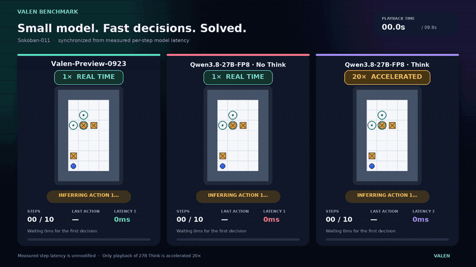
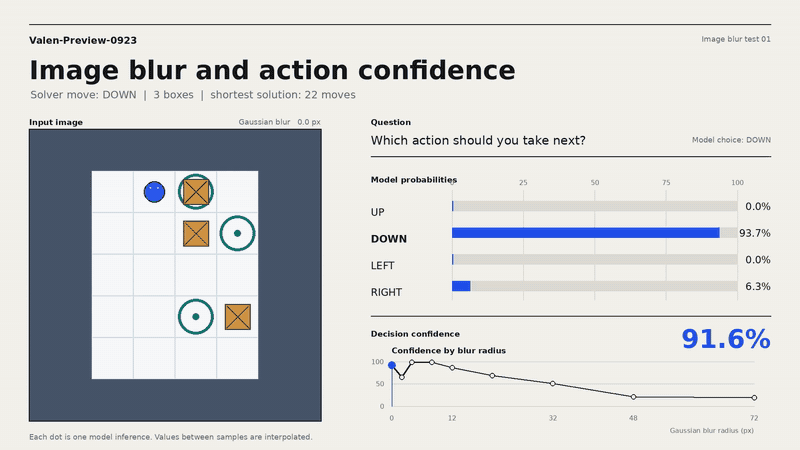
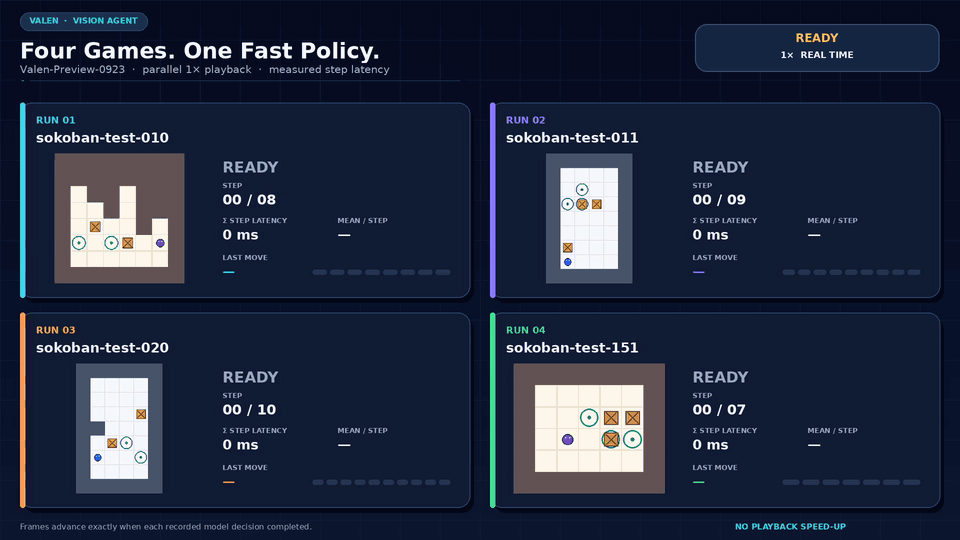

<p align="center">
  <br>
  
</p>

<p align="center">
  A multimodal decision model inspired by <a href="https://typesafe.ai/blog/introducing-system-one-models-and-jev">Jev</a> — text, images and video in; decision probabilities out.
</p>

<p align="center">
  <a href="https://huggingface.co/Valen-Team"></a>
  <a href="LICENSE"></a>
  <a href="pyproject.toml"></a>
  <a href="configs/train/"></a>
  <br>
  <a href="https://huggingface.co/Valen-Team/Valen-0.8B"></a>
  <a href="https://huggingface.co/Valen-Team/Valen-2B"></a>
  <a href="https://huggingface.co/Valen-Team/Valen-4B"></a>
  <a href="https://huggingface.co/spaces/yuhangzang/Valen-Preview-0923"></a>
  <a href="https://huggingface.co/datasets/Valen-Team/Valen-Training-General-100k"></a>
  <a href="https://huggingface.co/datasets/Valen-Team/VisualDecisionBench"></a>
  <a href="https://huggingface.co/datasets/Valen-Team/Valen-Eval-Game"></a>
</p>

<p align="center">
  <a href="README.md">English</a> · <b>简体中文</b><br>
  <a href="#简介">简介</a> · <a href="#news">News</a> · <a href="#演示">演示</a> · <a href="#模型下载">模型与数据集</a> · <a href="#实验结果">评测结果</a> · <a href="#快速开始">快速开始</a>
</p>

<a id="简介"></a>

## ✨ 简介

Valen（万澜）将视觉感知引入 System One 决策。受 [Jev](https://typesafe.ai/blog/introducing-system-one-models-and-jev) 启发，它根据任务指令，对文本、图像和视频中的信息进行判断，直接输出给定候选的概率分布，为程序提供结构化的决策接口。仓库提供模型实现、数据处理、SFT 与实验性 RLCD 训练，以及推理和评估命令，支持使用自有数据训练。

<a id="news"></a>

## 📰 News

- **2026-10-06**：发布正式版 **Valen models** 和 [**VisualDecisionBench**](https://huggingface.co/datasets/Valen-Team/VisualDecisionBench) 评测基准。
- **2026-09-23**：**Valen** 仓库开源，同时发布 [**Valen-preview**](https://huggingface.co/Valen-Team/Valen-Preview-0923)。

<a id="演示"></a>

## 🎬 演示

在 [Hugging Face Space](https://huggingface.co/spaces/yuhangzang/Valen-Preview-0923) 在线体验 **Valen-preview**。

<a id="demo-comparison"></a>

### 与 27B 生成模型对比

**Valen-preview** 读取棋盘图像，在每一步选择移动方向。在相同关卡，Valen-preview 用 9 次决策通关，累计决策耗时为 1.13 秒。Qwen3.8-27B-FP8 的 thinking 模式耗时 198.05 秒，no-thinking 模式未通关。

<p align="center">
  <br>
</p>

### 图像模糊与动作置信度

高斯模糊展示 **Valen-preview** 如何应对视觉细节的减少，决策与置信度动态变化的情况。清晰图像上的决策置信度为 91.6%，最强模糊下为 19.2%。

<p align="center">
  <br>
</p>

### 四局并行能力展示

四条成功的 **Valen-preview** 轨迹以 1× 速度并排播放，不做加速。每局需要 7–10 次决策，平均每步 122–128 毫秒，四局均于 1.24 秒内完成。

<p align="center">
  <br>
</p>

<a id="模型下载"></a>

## 📥 模型与数据集

**Valen** 模型与 **VisualDecisionBench** 数据集可从 Hugging Face 下载。

### Model（模型）

| 模型 | 下载 |
| --- | --- |
| Valen 0.8B | [🤗 Valen-0.8B](https://huggingface.co/Valen-Team/Valen-0.8B) |
| Valen 2B | [🤗 Valen-2B](https://huggingface.co/Valen-Team/Valen-2B) |
| Valen 4B | [🤗 Valen-4B](https://huggingface.co/Valen-Team/Valen-4B) |
| Valen-preview（早期版本） | [🤗 Hugging Face](https://huggingface.co/Valen-Team/Valen-Preview-0923) |

上方演示与下方快速开始使用 **Valen-preview**，该版本需同时下载 **Valen checkpoint** 和 **Qwen3.5-2B Base 模型**。

### Dataset（数据集）

| 数据集 | 用途 | 下载 |
| --- | --- | --- |
| VisualDecisionBench | VisualDecisionBench-Image 与 VisualDecisionBench-Video 评测 | [🤗 Hugging Face](https://huggingface.co/datasets/Valen-Team/VisualDecisionBench) |
| General 100k（早期版本） | 训练 | [🤗 Hugging Face](https://huggingface.co/datasets/Valen-Team/Valen-Training-General-100k) |
| General 5k（早期版本） | 评测 | [🤗 Hugging Face](https://huggingface.co/datasets/Valen-Team/Valen-Eval-General-5k) |
| Sokoban（早期版本） | 训练与评测 | [🤗 Hugging Face](https://huggingface.co/datasets/Valen-Team/Valen-Eval-Game) |

<a id="实验结果"></a>

## 📊 评测结果 — Valen

**覆盖 0.8B、2B、4B 的视觉决策模型。** Valen 采用 Qwen3.5 + Mixer 和共享 state 推理，在 Million 级别的数据集上进行SFT。以下为 **VisualDecisionBench-Image、VisualDecisionBench-Video、公开 JevBench** 三组评测。

<p align="center">
  <a href="assets/figures/evaluation-20261006/eval_v1.png"></a>
</p>

<p align="center">
  <a href="assets/figures/evaluation-20261006/video.png"></a>
</p>

<p align="center">
  <a href="assets/figures/evaluation-20261006/jevbench.png"></a>
</p>

早期结果保留在[归档 README](history/README_zh_preview.md)。

<a id="快速开始"></a>

## 🚀 快速开始

先按[环境要求](docs/technical.md#环境要求)安装依赖，再下载 Valen-preview checkpoint 及其对应的 Qwen3.5-2B Base 模型。

```bash
# 下载 Valen-preview checkpoint。
hf download Valen-Team/Valen-Preview-0923 --local-dir models/Valen-Preview-0923

# 下载 Qwen3.5-2B Base 模型。
hf download Qwen/Qwen3.5-2B --local-dir models/Qwen3.5-2B

# 使用自己的配置训练模型。
python -m valen.train \
  --config configs/train/qwen/sft_warmup.json

# 加载下载好的 Valen-preview 进行推理。
python -m valen.inference \
  --checkpoint models/Valen-Preview-0923 \
  --data data/smoke/train.jsonl \
  --output output/sft_warmup/predictions.jsonl

# 用同一组合成样本检查评估流程。
python -m valen.evaluate \
  --checkpoint models/Valen-Preview-0923 \
  --data data/smoke/train.jsonl \
  --output output/sft_warmup/smoke_eval
```

`data/smoke` 有少量简单题目，仅仅用于测试功能是否正常运行。

<details>
<summary>一条带图片输入的标注记录</summary>

JSONL 每行是一条记录。下例使用仓库里的[评测总览图](assets/figures/evaluation-results.png)，假设保存为仓库根目录的 `example.jsonl`。

```json
{
  "group_id": "evaluation-general-2b",
  "request": {
    "state": {
      "messages": [{
        "role": "user",
        "content": [
          {"type": "text", "text": "比较图中 General 任务上 2B 模型的准确率和平均单题耗时。"},
          {"type": "image_url", "image_url": {"url": "assets/figures/evaluation-results.png"}}
        ]
      }]
    },
    "questions": {
      "best_2b": {
        "type": "choice",
        "instructions": "在 General 任务上，平均单题耗时低于 200 ms 的 2B 模型中，哪个准确率最高？",
        "criteria": {
          "qwen": "Qwen3.5-2B",
          "valen": "Valen-preview"
        }
      }
    }
  },
  "targets": {
    "best_2b": {"probabilities": {"qwen": 0.0, "valen": 1.0}}
  }
}
```
</details>

<a id="参与贡献"></a>

## 🤝 参与贡献

欢迎一起改进 Valen。你可以通过 [Issues](https://github.com/Liuziyu77/Valen/issues) 反馈问题、分享应用场景和实验结果，也可以提交 [Pull Requests](https://github.com/Liuziyu77/Valen/pulls) 改进代码与文档、补充训练数据或评测任务。

欢迎扫描下方二维码加入 Valen 微信群，一起讨论项目、交流使用体验和实验结果。

<p align="center">
  
</p>

<a id="许可与致谢"></a>

## 📄 许可与致谢

代码使用 [Apache 2.0](LICENSE) 许可。基础模型和来源数据集遵循各自的许可。

模型基于 [Qwen3.5](https://huggingface.co/Qwen/Qwen3.5-2B)，决策接口受 [TypeSafe Jev](https://typesafe.ai/blog/introducing-system-one-models-and-jev) 启发。
