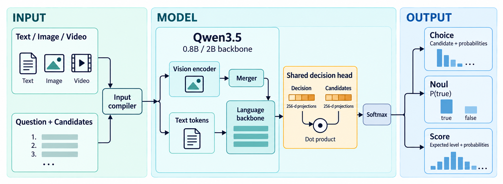
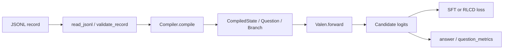

# 模型与执行流程

Valen 把每道题转换成候选集合，用 Qwen3.5 的隐状态为候选打分。候选数量由请求决定，决策头输出每个候选的一个 logit，不使用词表输出层，也不调用 `generate()`。三种任务共用backbone和decision head。



## 从 JSONL 到决策



`request.state` 是同一条记录中各题共用的上下文；`request.questions` 定义任务、指令和候选。`targets` 提供监督标签。问题 ID、`group_id`、标签和 `meta` 不进入提示词；Choice 的候选名会进入提示词。

| 入口 | 执行路径 | 处理范围 |
| --- | --- | --- |
| `python -m valen.train` | `training.runner.main → run` | 只编译有标签的问题，执行 SFT 或 RLCD |
| `python -m valen.inference` | `evaluation.inference.main → predict → answer` | 编译所有问题，每条输入返回一条响应 |
| `python -m valen.evaluate` | `evaluation.evaluate.main → run → question_metrics / summarize` | 只评估有标签的问题，逐题输出并汇总指标 |

完整目录和测试对应关系见[代码目录](../valen/README.md)。仓库根目录的 `evaluation/` 是独立的任务环境包；其中 Sokoban 的 `ValenPolicy` 复用这里的编译器、模型和 `predict`，将每步截图与规则转换成下一动作。完整游戏流程见[任务评测](../evaluation/README.md)。

## 编译器做了什么

实现位于 [data/compiler.py](../valen/data/compiler.py)，记录级校验位于 [data/schema.py](../valen/data/schema.py)。

1. 选择要处理的问题。训练和评估使用 `labeled_only=True`；整条记录没有标签时，在读取媒体之前返回空结果。
2. 将文本 state 转成 user 消息，或读取已有的消息列表。解析本地媒体路径，记录媒体摘要。
3. 调用处理器的 `apply_chat_template`，编码一次公共 state，取得 token、mutimodal tensor和视觉网格。视频采样元数据保留。
4. 为每个分支附加 user 消息前缀、任务类型、指令、候选描述和 `Decision:`。按片段编码时直接记录候选末 token 与决策末 token 的位置。
5. 将分支整理为 `Question`，标签按当前候选顺序排列。超过 `max_length` 的分支直接报错。

| 任务 | 候选 | 每道题的分支数 | 进入分支的候选内容 |
| --- | --- | --- | --- |
| Choice | 1–255 个命名候选 | 1 | 全部候选名及描述；训练时随机排列 |
| Noul | 固定 `true`、`false` | 1 | 固定的中英文真假描述 |
| Score | 2–10 个有序等级 | 等级数 K | 仅该等级描述，不含等级编号和其他等级描述 |

Score 的各分支分别产生一个 logit，拼成长度 K 的向量后再做 softmax。等级顺序用于标签、RPS 和输出期望值；分支不直接看到自己的等级编号。

`CompiledState` 保存问题列表、token 计数和媒体信息。每个 `Question` 保存候选键、描述、标签及分支；每个 `Branch` 保存backbone输入和决策头需要读取的位置。

### 公共上下文与计算量

公共 state 的**处理器编码**只执行一次，backbone仍对每个分支完整forward。分支之间不共享backbone KV cache，模型forward明确设置 `use_cache=False`。一个 state 若有一道 Choice、一道 Noul 和一道三级 Score，就需要五次backboneforward。

设公共 state 长度为 B，各分支后缀长度为 S₁…Sₙ：

```text
logical_tokens = B + sum(Sᵢ)
compute_tokens = sum(B + Sᵢ)
```

推理返回的 `usage.input_tokens` 使用前者，`internal_usage.compute_tokens` 使用后者。训练的 `tokens_per_step` 按后者打包完整 state，且是每个 rank 的预算。这个数字包含分支中的视觉 token，不包含反向传播或 RLCD 重复forward的成本，也不是 FLOPs。

## backbone与decision head

[build_model](../valen/modeling/model.py) 先用 `Qwen3_5ForConditionalGeneration.from_pretrained` 加载本地权重，再取出 `.model`。词表输出层随外层容器释放。注意力实现固定为 `eager`；配置支持 `bf16` 和 `fp32`。

`Valen.forward(question)` 按顺序执行各分支。`DecisionHead` 读取候选描述最后一个 token 的隐状态 `h_candidate[k]`，以及 `Decision:` 最后一个 token 的隐状态 `h_decision`。两组无偏置线性投影默认输出 256 维向量：

```text
logit[k] = dot(W_decision h_decision, W_candidate h_candidate[k]) / sqrt(projection_dim)
p = softmax(logits / temperature)
```

决策头先把读取的隐状态转成 FP32，损失也用 FP32。它的参数量为 `2 × hidden_size × projection_dim`，不随候选数变化。`Valen.forward` 返回 logits；softmax 和输出字段由推理或训练目标负责。

## 参数开放与优化

backbone加载后先整体冻结，再按 `stage` 开放参数：

| Stage | 可训练部分 |
| --- | --- |
| `warmup` | 新建的决策头 |
| `text` | 决策头、LLM中所有 `nn.Linear` 的 LoRA；数据必须为纯文本 |
| `joint` | `text` 的参数，加视觉 merger；可用多模态数据 |
| `vision_top` | `joint` 的参数，加视觉编码器最后四个 block |

LoRA 目标从 `backbone.language_model.named_modules()` 中逐个枚举，不匹配vision tower或决策头。默认 rank 为 32、alpha 为 64、dropout 为 0。四组参数有独立学习率，优化器统一为 AdamW，当前没有学习率调度器。配置和默认值见[配置参考](configuration.md)。

`method` 与 `stage` 独立。SFT 使用候选分布交叉熵，可为 Score 加 RPS；RLCD 从候选分布采样离散动作，使用clipped policy optimization、固定参考 KL 和 Brier 辅助项。两者都需要标签，详见[训练说明](../valen/training/README.md)。

### 分布式训练

[training/distributed.py](../valen/training/distributed.py) 实现显式同步的数据并行，每卡持有完整模型，不做模型或优化器分片。每轮打乱记录后按 rank 取切片。

各卡先逐题反向传播并累积梯度，再对梯度做求和。每个问题的损失已经除以「全局有效 state 数 × 本 state 的有标签问题数」。空闲 rank 也参加同步。

### 冻结特征复用

`cache_frozen_features=true` 只接入了 **RLCD**。它要求整个backbone冻结，在每个 rollout 批次中保留候选与决策位置的特征，让旧策略、参考决策头和后续更新复用。每卡首次使用时额外执行完整forward，核对 logits 完全一致。

当 `beta>0` 时，默认 RLCD 在每卡额外复制一份冻结参考模型。启用上述缓存后只复制参考决策头。SFT 仍调用完整的 `model(question)`。

## 保存、加载和输出

checkpoint 只保存当前可训练参数的值及优化器、进度、随机状，它不能脱离基础模型使用。RLCD 还保存初始参考参数。`--initialize` 用已有参数开始新实验；`--resume` 恢复原优化过程，要求进程数和训练配置兼容。具体文件和约束见[训练说明](../valen/training/README.md#checkpoint-与恢复)。

Choice 返回最大概率候选，Noul 返回 `P(true)`，Score 返回等级索引的期望值。Choice/Score 的 `confidence` 是分布集中度指标。完整字段、公式与评估口径见[推理与评估](evaluation.md)。

模型类和响应标识为 `Valen`。Python 包、命令入口和新生成的基础模型清单均使用 `valen`；checkpoint 的参数key没有变化。
