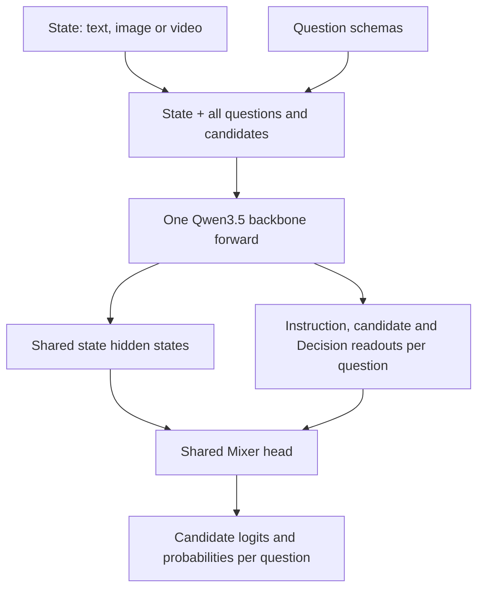

# Qwen shared-state training / 共享 state 训练

`model.qwen_execution = "shared_state"` enables one Qwen backbone sequence for
all questions in a record. `share_state` is accepted as a spelling alias and saved
as `shared_state`. One-question records use exactly the same execution path.
The default `question` preserves the inputs and Score branches of older models.

## Model and features / 模型与特征



The input sequence is:

```text
[state messages and media, once]
user:
  Question 1: task, instruction, candidates
  Question 2: task, instruction, candidates
assistant:
  Question 1 Decision:
  Question 2 Decision:
```

Each question has its own instruction span, candidate spans and Decision position.
The Mixer reads four roles per candidate: mean-pooled state, instruction,
candidate description, and the final Decision token. Its default two blocks mix
the four roles and their channels. The head is shared across questions and
candidates; it returns one FP32 logit per candidate. Bilinear, MLP and role-MLP
heads are also supported with the same shared backbone execution.

All Choice, Noul and Score questions share one graph. Score sees all ordered grade
descriptions and emits all logits in one forward. The schemas use ordinary causal
attention, so question order, option order and other questions can affect results.
This is a changed input format that needs training and held-out validation.

Labels and external IDs do not enter the sequence. Training and evaluation retain
**all request questions in the input**, including unlabeled questions; only labeled
readouts contribute to loss/metrics. Inference returns all requested readouts.
A record without any labels is skipped before reading media during training.

## Batching and losses / 批量与损失

Within a state, all questions reuse one backbone forward and one backward graph.
With `microbatch_size > 1`, different states form separate padded rows in one
batch; images/video patches are concatenated once per state. Their causal contexts
stay separate. In shared mode, `microbatch_size` counts **states**, not questions.
`microbatch_max_tokens` bounds padded batch tokens; an oversized single row runs
alone, subject to `max_length` and `tokens_per_step`.

Two reductions are supported for SFT and RLCD:

- `state_mean` (default): average labeled question losses within each state, then
  average states globally across ranks. This preserves the earlier weighting.
- `question_mean`: average all labeled question losses globally across ranks.
  This preserves a mixture specified by QA counts when records contain different
  numbers of questions. The new Mixer training recipes use this reduction.

Soft labels, cross-entropy, Brier and Score RPS keep their existing definitions.
FlashAttention-2, language LoRA, visual-merger updates, gradient checkpointing,
CPU prefetch and distributed token accumulation are supported. RLCD also supports
shared policy/reference forwards and a frozen-feature cache. Shared-state RLCD
can batch both rollout/reference inference and policy updates, with CPU prefetch.
Frozen-feature caching remains limited to microbatch size 1.

`logical_tokens` and `compute_tokens` both count the complete shared sequence once.
`max_length` applies to the entire state, schemas and readouts. Overlong records
raise an error; no questions or tokens are silently dropped.

## Prepare data / 整理训练数据

Native multi-question JSONL records can be used directly. For a one-QA-per-record
mixture, group records with identical state, group ID, assets and source/domain/
modality metadata:

```bash
python -m valen.data.group_questions \
  --input next-generation-qwen/mixer-gvt-261001/data/train.jsonl \
  --output next-generation-qwen/shared-state/data/train.jsonl \
  --max-questions 4

python -m valen.data.group_questions \
  --input next-generation-qwen/mixer-gvt-261001/data/warmup.jsonl \
  --output next-generation-qwen/shared-state/data/warmup.jsonl \
  --max-questions 4
```

The command preserves every QA and label, splits groups at the question limit,
renames colliding question IDs deterministically, and records their original line,
ID and record ID. It resolves relative media paths before moving records and
writes a manifest with QA counts, task/source counts and SHA-256 digests. A disk
index bounds memory use; `--work-dir` selects its temporary storage directory.
The source JSONL stays unchanged. Group each split separately. Context hashes in
the tool control merging, not train/eval separation.

The previous G395k/V200k-QA/T400k mixture keeps 995k QA after grouping; the 10%
warmup subset keeps 99.5k QA. Use `question_mean` to retain those QA proportions.
The initial question limit of four does not guarantee a token limit; if a compiled
record is too long, reduce the question limit or adjust media/sequence budgets.

## Two-stage training / 两阶段训练

The recipes use Qwen3.5-2B, Mixer and FlashAttention-2. They initially point to
smoke data and cap training at 100 steps. Copy them into a new experiment, set
the data/output paths, and raise the step limit for full training. Keep head
dimensions, video frame sampling and media budgets consistent across stages.

```bash
# Head-only warmup from the published Qwen backbone.
VALEN_GPUS=8 bash scripts/train/launch.sh \
  configs/train/qwen/sft_shared_state_warmup.json

# Mixer + language LoRA + visual merger, initialized from this warmup.
VALEN_GPUS=8 bash scripts/train/launch.sh \
  configs/train/qwen/sft_shared_state_joint.json \
  --initialize output/qwen-shared-state/warmup/latest

python -m valen.evaluate --checkpoint output/qwen-shared-state/joint/latest \
  --data data/smoke/train.jsonl --output output/qwen-shared-state/evaluation
```

Inference/evaluation recover execution mode from checkpoint config. An omitted
mode and explicit `question` normalize identically, allowing old checkpoints to
resume. `--resume` requires the same execution mode and loss reduction; use
`--initialize` with a new output directory when changing either. Warmup to joint
initialization retains the same shared-state input format.

## Validation / 验证

```bash
python -m pytest -q tests/qwen/test_shared_state.py \
  tests/common/test_group_questions.py tests/integration/test_sft_training.py

# Actual pretrained 2B integration on one CUDA GPU.
python scripts/smoke/qwen/gpu_smoke.py \
  --config configs/train/qwen/sft_shared_state_joint.json \
  --output artifacts/qwen-shared-state-smoke
```

CPU tests check one-forward/backward gradients for all four heads, partial-label
input parity, unequal-question batch weighting, cached RLCD, checkpoint resume,
and tiny real Qwen3.5 with DeltaNet, full attention and synthetic video patches.
The GPU command checks pretrained loading, joint gradients, saving/restoring,
stage initialization, RLCD and the configured attention backend. These checks do
not measure held-out task quality or a throughput gain.
